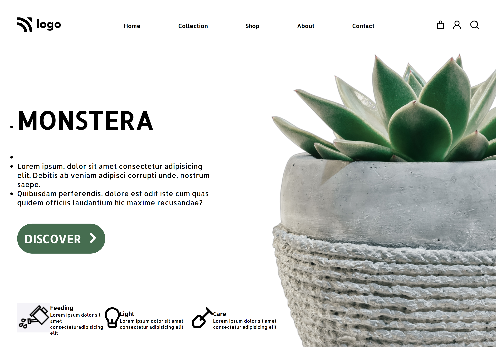

# Hello I am **Devang** and Welcome to **Plant Landing Page**.

## 💻 Tech Stack Used :

  

 

 ## Project Name : Plant Landing Page !

 
Some website template left me wondering how are the made? And this is one of them understanding more of positions float and handling so many svg file taught me alot.
 

 ## Time for completion: 6 hrs 
 

 
### Do Check it Live on Below Link :

[Live Link !]()